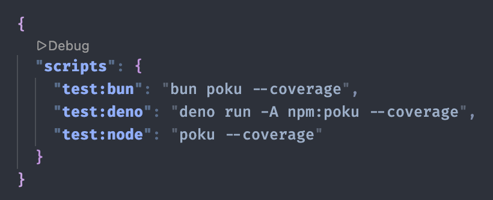

<div align="center">


# @pokujs/coverage

_**Stage: Experimental**_ 🧟

Enjoying **Poku**? [Give him a star to show your support](https://github.com/wellwelwel/poku) ⭐

---

📚 [**Documentation**](https://poku.io/docs/documentation/helpers/coverage/coverage)

</div>

---

☔️ [**@pokujs/coverage**](https://github.com/pokujs/coverage) is a **Poku** plugin that unifies coverage collection across **Node.js**, **Deno**, and **Bun**.

> [!TIP]
>
> [**@pokujs/coverage**](https://github.com/pokujs/coverage) supports **JSONC**, **YAML**, and **TOML** config files out of the box, allowing comments in your configuration. You can also use **JavaScript** and **TypeSript** by setting the options directly in the plugin.

> 

---

## Quickstart

### Install

```bash
npm i -D poku @pokujs/coverage
```

### Usage

#### Enable the Plugin

```js
// poku.config.js
import { coverage } from '@pokujs/coverage';
import { defineConfig } from 'poku';

export default defineConfig({
  plugins: [coverage()],
});
```

Run `poku` and a coverage summary will be printed after your test results.

---

## Options

### `requireFlag`

- **Type:** `boolean`
- **Default:** `false`

When `true`, the plugin only activates if `--coverage` is passed on the CLI.

### `reporter`

- **Type:** `ReporterName | ReporterName[]`
- **Default:** `'text'`

One or more reporters to run. Available: `'lcov'`, `'lcovonly'`, `'text-lcov'`, `'v8'`, `'text'`, `'text-summary'`, `'teamcity'`, `'json'`, `'json-summary'`, `'cobertura'`, `'clover'`, `'none'`.

### `reportsDirectory`

- **Type:** `string`
- **Default:** `'./coverage'`

Directory where report files are written. Resolved relative to the Poku working directory.

### `include`

- **Type:** `string[]`
- **Default:** `[]`

Glob patterns for files to include. When non-empty, only matching files appear in reports.

### `exclude`

- **Type:** `string[]`
- **Default:** (extends `@istanbuljs/schema`)

Glob patterns for files to exclude. Replaces the default list when provided.

### `all`

- **Type:** `boolean`
- **Default:** `false`

Walk the filesystem and report every source file under `cwd`, including those never touched by tests (reported as zero coverage).

### `checkCoverage`

- **Type:** `number | CheckCoverageThresholds`
- **Default:** `undefined`

Fail the run when coverage falls below configured percentages. Pass a bare number to apply to all metrics, or an object with per-metric values. Set `perFile: true` to enforce per-file.

### `skipFull`

- **Type:** `boolean`
- **Default:** `false`

Hide fully-covered files (every non-null metric ≥ 100%) from the `text` reporter table. Totals are unaffected.

### `skipEmpty`

- **Type:** `boolean`
- **Default:** `false`

Hide files with no executable code from the `text` reporter table. Totals are unaffected.

### `watermarks`

- **Type:** `Partial<Watermarks>`
- **Default:** `[50, 80]` per metric

`[lowMax, highMin]` thresholds for classifying percentages as `low` / `medium` / `high` in the `text` reporter.

### `hyperlinks`

- **Type:** `boolean | IdeName`
- **Default:** `true`

Controls clickable file links in the `text` reporter. `true` = plain `file://` links; `false` = disabled; or specify `'vscode'`, `'jetbrains'`, `'cursor'`, `'windsurf'`, `'vscode-insiders'` to emit IDE-specific URLs.

### `excludeAfterRemap`

- **Type:** `boolean`
- **Default:** `true`

When `true`, globs match original source paths (post source-map remap). When `false`, globs match transpiled paths (pre-remap, mirrors c8).

### `tempDirectory`

- **Type:** `string`
- **Default:** auto

Directory where raw coverage data is written. When omitted, a temp dir is created and cleaned up automatically.

### `clean`

- **Type:** `boolean`
- **Default:** auto

Override temp-directory cleanup at teardown. `undefined` = auto (clean iff auto-generated); `true` = always clean; `false` = never clean.

### `config`

- **Type:** `string | false`
- **Default:** `undefined`

Path to a config file, or `false` to disable auto-discovery.

---

## Examples

### Require `--coverage` flag

By default, coverage runs whenever the plugin is active. Use `requireFlag` to only collect coverage when `--coverage` is passed to the CLI, keeping watch mode, debugging, and filtered runs fast:

```js
coverage({
  // ...
  requireFlag: true,
});
```

```bash
# No coverage (plugin is a no-op)
poku test/

# With coverage
poku --coverage test/
```

### Using a config file

```jsonc
// .coveragerc
{
  // Only cover source files
  // ...
}
```

```js
coverage({
  config: '.coveragerc', // or false to disable auto-discovery
});
```

When no `config` is specified, the plugin automatically searches for `.coveragerc`, `.coverage.json`, `.coverage.jsonc`, `.coverage.yaml`, or `.coverage.toml` in the working directory.

You can also specify the config path via CLI:

```bash
poku --coverageConfig=.coveragerc test/
```

> [!NOTE]
>
> **Priority order:**
>
> - For config file discovery: `--coverageConfig` (CLI) > `config` (plugin option) > auto-discovery
> - For coverage options: plugin options > config file options

---

## How It Works

Under **Deno**, the plugin sets `DENO_COVERAGE_DIR` before **Poku** spawns any `deno test` child process. Each child inherits the env var automatically and writes raw coverage data into the shared temp directory. On teardown, the plugin shells out to `deno coverage <tempDir>` and forwards the text summary to the console — no JavaScript coverage library is used.

**Node.js** and **Bun** support is coming. Because no established coverage-reporting library on npm (c8, nyc, istanbul-\*, monocart-\*) works across all three runtimes, every runtime path will delegate to the runtime's own CLI (`deno coverage`, `node --experimental-test-coverage`, `bun test --coverage`) rather than importing a shared library. [**Poku**](https://poku.io) is the only test runner that covers all three — follow it for updates.

---

### File Exclusions

The plugin strips the following files from every report (`text` and `lcov`) before they are emitted, so the numbers reflect only the source code you actually care about:

- **Test files discovered by Poku.** Every file Poku passes through its `runner` hook is recorded and dropped from the produced LCOV. This naturally follows whatever test-file pattern Poku is configured with (default `/\.(test|spec)\./i`) — the plugin never re-implements a parallel regex, so it stays in sync with Poku automatically.
- **`node_modules/` and `.git/`.** These directories are unconditionally banned from coverage output. Dependencies and VCS metadata are never meaningful coverage targets, and this mirrors Poku's own discovery rules.

The raw `v8` reporter is intentionally **not** affected: it always writes unfiltered raw V8 JSON data, which is the escape hatch when you need the full picture.

---

## Acknowledgements

[**@pokujs/coverage**](https://github.com/pokujs/coverage) internally adapts parts of the projects [**v8-to-istanbul**](https://github.com/istanbuljs/v8-to-istanbul), [**@jridgewell/trace-mapping**](https://github.com/jridgewell/sourcemaps), and [**istanbul-reports**](https://github.com/istanbuljs/istanbuljs) for multi-runtime support, enabling **Istanbul** reports for both **Node.js**, **Deno**, and **Bun**.

- `.js`, `.css`, `.png`, and `.ico` assets from `html` and `html-spa` reporters are copied verbatim from [**istanbul-reports**](https://github.com/istanbuljs/istanbuljs).

---

## License

**MIT** © [**wellwelwel**](https://github.com/wellwelwel) and [**contributors**](https://github.com/pokujs/coverage/graphs/contributors).
